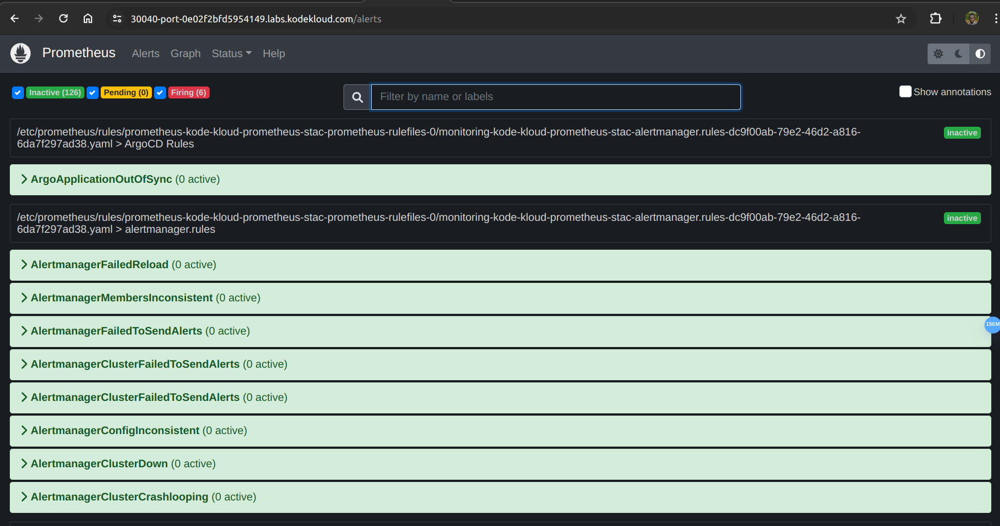

# Create the ArgoCD service monitors below within the argocd namespace.

   1. argocd-metrics

   2. argocd-server-metrics

   3. argocd-repo-server-metrics

   4. argocd-applicationset-controller-metrics

Set metadata.labels.release to kode-kloud-prometheus-stack

# solution

Create a yaml definition for argocd-metrics:

vi argocd-metrics.yaml

Add below code in it:

apiVersion: monitoring.coreos.com/v1
kind: ServiceMonitor
metadata:
  name: argocd-metrics
  namespace: argocd
  labels:
    release: kode-kloud-prometheus-stack
spec:
  selector:
    matchLabels:
      app.kubernetes.io/name: argocd-metrics
  endpoints:
  - port: metrics

Create a yaml definition for argocd-server-metrics:

vi argocd-server-metrics.yaml

Add below code in it:

apiVersion: monitoring.coreos.com/v1
kind: ServiceMonitor
metadata:
  name: argocd-server-metrics
  namespace: argocd
  labels:
    release: kode-kloud-prometheus-stack
spec:
  selector:
    matchLabels:
      app.kubernetes.io/name: argocd-server-metrics
  endpoints:
  - port: metrics

Create a yaml definition for argocd-repo-server-metrics:

vi argocd-repo-server-metrics.yaml

Add below code in it:

apiVersion: monitoring.coreos.com/v1
kind: ServiceMonitor
metadata:
  name: argocd-repo-server-metrics
  namespace: argocd
  labels:
    release: kode-kloud-prometheus-stack
spec:
  selector:
    matchLabels:
      app.kubernetes.io/name: argocd-repo-server
  endpoints:
  - port: metrics

Create a yaml definition for argocd-applicationset-controller-metrics:

vi argocd-applicationset-controller-metrics.yaml

Add below code in it:

apiVersion: monitoring.coreos.com/v1
kind: ServiceMonitor
metadata:
  name: argocd-applicationset-controller-metrics
  namespace: argocd
  labels:
    release: kode-kloud-prometheus-stack
spec:
  selector:
    matchLabels:
      app.kubernetes.io/name: argocd-applicationset-controller
  endpoints:
  - port: metrics

To apply all templates run the below commands:

kubectl apply -f argocd-metrics.yaml
kubectl apply -f argocd-server-metrics.yaml
kubectl apply -f argocd-repo-server-metrics.yaml
kubectl apply -f argocd-applicationset-controller-metrics.yaml

Click on the Grafana button to access the Grafana UI, and log in using the credentials below.

   Username: admin

   Password: Fetch the password using below command
   kubectl -n monitoring get secrets kode-kloud-prometheus-stack-grafana -o json | jq .data'."admin-password"' -r | base64 -d

   Import https://grafana.com/grafana/dashboards/14584-argocd/ dashboard in Grafana with default options.

   

# Configure an AlertManager Rule for ArgoCD, which will raise an alert when an Argocd application status is changed to OutOfSync.

To do the same, edit prometheusrules called kode-kloud-prometheus-stac-alertmanager.rules under monitoring namespace, by adding the YAML snippet below:

- name: ArgoCD Rules
  rules:
    - alert: ArgoApplicationOutOfSync
      expr: argocd_app_info{sync_status="OutOfSync"} == 1
      for: 5m
      labels:
        severity: warning
      annotations:
         summary: "'{{ $labels.name }}' Application has
                    synchronization issue"

# Create an ArgoCD application using either UI or CLI.

   Application Name: alert-manager-demo

   Project Name: default

   Sync Policy: manual

   Sync Options: AUTO-CREATE NAMESPACE

   Repository URL: <Gitea URL>/bob/gitops-argocd.git

   Repo Type: Git

   Path: ./solar-system

   Cluster URL: https://kubernetes.default.svc

   Namespace: alert-demo

Access the Gitea server with below credentials

    username: bob

    password: bob@123

Access the ArgoCD UI and CLI with below credentials.

    User: admin

    Password: admin123

Created 'alert-manager-demo' Argocd application?

