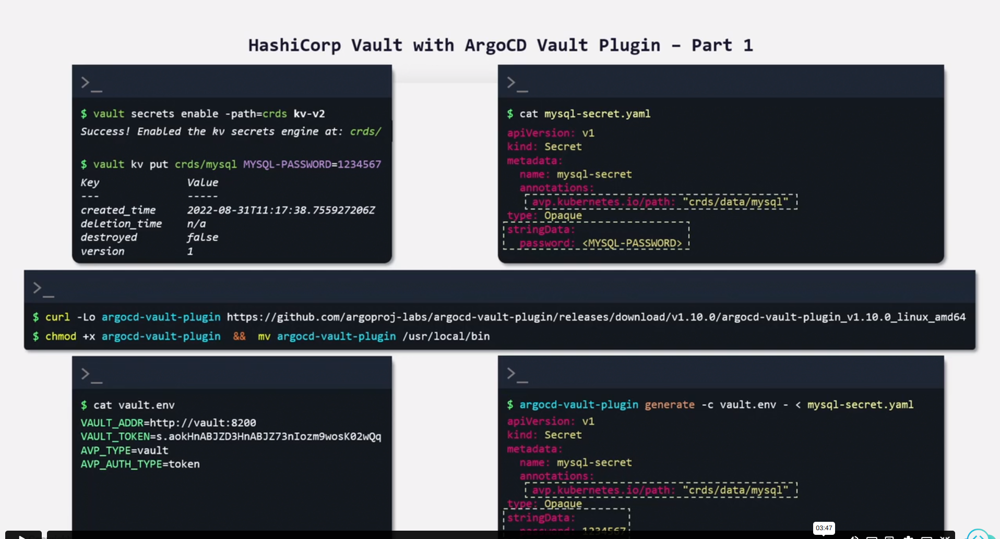
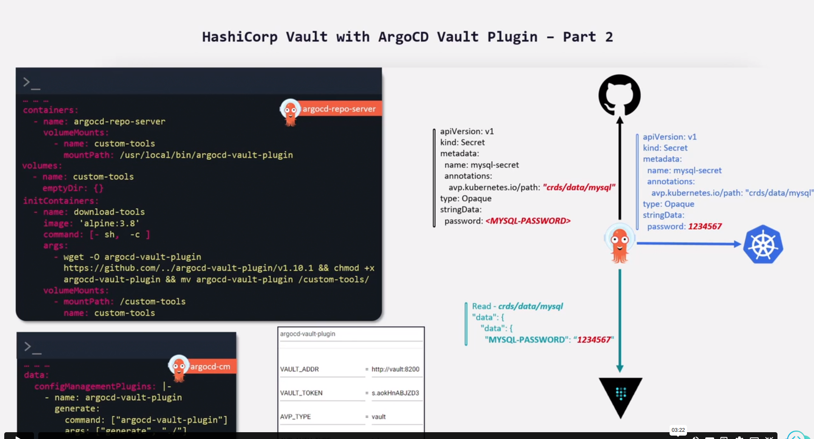

# Deploy the Bitnami sealed secret controller by creating an Argocd application using either UI or CLI and synchronize the app using the following details.

   Application Name: sealed-secrets

   Project Name: default

   Sync Policy: auto

   Repository URL: https://bitnami-labs.github.io/sealed-secrets

   Repository Type: Helm

   Chart: sealed-secrets

   Version: 2.2.0

   Cluster URL: https://kubernetes.default.svc

   Namespace: kube-system

Make sure the application is in Healthy state before hitting the Check button.

You can access the ArgoCD UI and ArgoCD CLI by using the following credentials.

    User: admin

    Password: admin123

# Install kubeseal CLI version 0.18.0. For help installing KubeSeal, click on the KubeSeal button at the top of the workspace.

wget https://github.com/bitnami-labs/sealed-secrets/releases/download/v0.18.0/kubeseal-0.18.0-linux-amd64.tar.gz
tar -xvzf kubeseal-0.18.0-linux-amd64.tar.gz kubeseal
sudo install -m 755 kubeseal /usr/local/bin/kubeseal

# Extract the sealed-secrets controller TLS certificate from the kube-system namespace and store it in a file named /root/sealedSecret-publicCert.crt.

kubectl -n kube-system get secret sealed-secrets-keyfxtkf -o json | jq -r .data'."tls.crt"' | base64 -d > /root/sealedSecret-publicCert.crt

# Create /root/mysql-password_k8s-secret.yaml specification file for a generic Kubernetes secret called app-crds and add the secret data below to it.

   username: admin-dev-group

   password: paSsw0rD-1erT-diS

   apikey: zaCELgL-0imfnc8mVLWwsAawjYr4Rx-Af50DDqtlx

kubectl create secret generic app-crds --from-literal=apikey=zaCELgL-0imfnc8mVLWwsAawjYr4Rx-Af50DDqtlx --from-literal=username=admin-dev-group --from-literal=password=paSsw0rD-1erT-diS -o yaml --dry-run=client > mysql-password_k8s-secret.yaml
