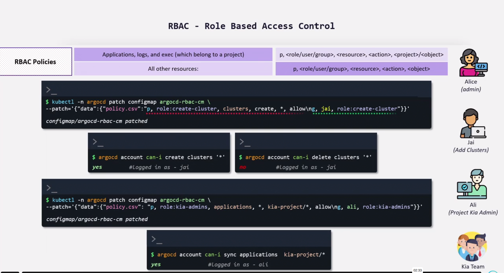
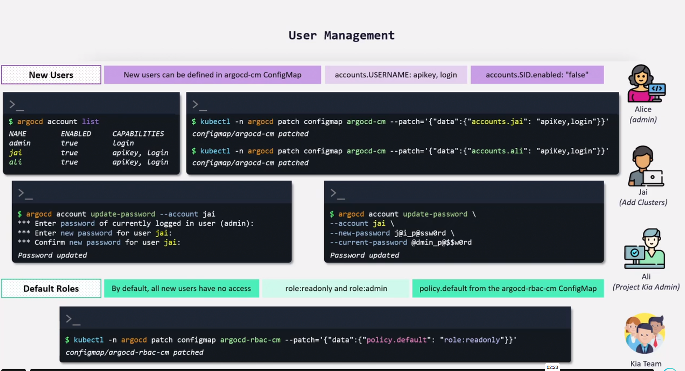
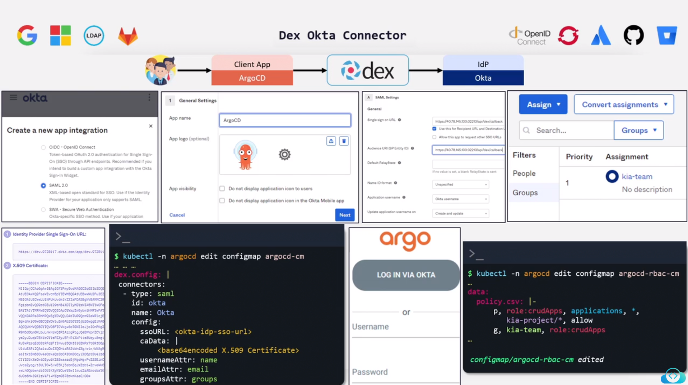

Gitea and ArgoCD are already set up and ready for you to use. You can access each using the respective buttons on the bar at the top of the workspace.

You can access the Gitea server by using the following credentials.

    Username: bob

    Password: bob@123

You can access the ArgoCD UI and ArgoCD CLI by using the following credentials.

    User: admin

    Password: admin123

How many data fields does the argocd-cm configmap have under the ArgocCD namespace?

- kubectl -n argocd get cm argocd-cm

Create a new ArgoCD account using the following credentials.

    Account Name: alice

    Capabilities: apikey, login

solution - kubectl -n argocd patch configmap argocd-cm --patch='{"data":{"accounts.alice": "apiKey,login"}}'

Update the password of the newly created account names alice.

    Account name: alice

    New Password: alice123

    Run below command:

argocd account update-password --account alice

It will ask for few details as below:

*** Enter password of currently logged in user (admin): admin123
*** Enter new password for user alice: alice123
*** Confirm new password for user alice: alice123

Please note that in real time passwords won't be visible on screen.

Login to Argocd using the newly created alice account and try to create an application using the following information.

    Application Name: demo-app

    Project Name: default

    Sync Policy: Manual

    Sync Options: Auto-create Namespace

    Repository URL: <Gitea URL>/bob/gitops-argocd.git

    Path: ./health-check

    Cluster URL: https://kubernetes.default.svc

    Namespace: demo-app

Were you able to create this application?

You can access the ArgoCD UI and ArgoCD CLI by using the following credentials.

    User: admin

    Password: admin123

    Which of the following ArgoCD resources is used to store RBAC policies in ArgoCD?
    configmap - argocd-rbac-cm

    Create a new role with create application access using the details below and assign it to user alice.

    Role Name: create-app

    Project: any

    kubectl -n argocd patch configmap argocd-rbac-cm \
--patch='{"data":{"policy.csv":"p, role:create-app, applications, create, *, allow\ng, alice, role:create-app"}}'

Login again to Argocd using alice account and try to create an application again using the details below.

    Application Name: demo-app

    Project Name: default

    Sync Policy: Manual

    Sync Options: Auto-create Namespace

    Repository URL: <Gitea URL>/bob/gitops-argocd.git

    Path: ./health-check

    Cluster URL: https://kubernetes.default.svc

    Namespace: demo-app

Although you are able to create the application, you will notice that you can't see it in the UI since alice user doesn't have those permissions.

You can access the ArgoCD UI and ArgoCD CLI by using the following credentials.

    User: admin

    Password: admin123

Let's login to the admin account through ArgoCD CLI and try to sync the demo-app application.

argocd login $(kubectl get service argocd-server -n argocd --output=jsonpath='{.spec.clusterIP}') --username admin --password admin123 --insecure
argocd app sync demo-app