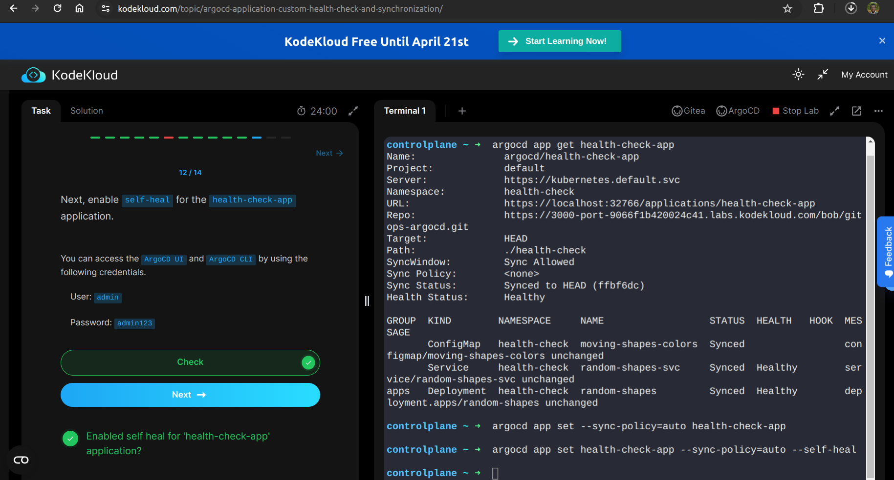

Gitea and ArgoCD are already set up and ready for you to use. You can access each using the respective buttons on the bar at the top of the workspace.

You can access the Gitea server by using the following credentials.

    Username: bob

    Password: bob@123

You can access the ArgoCD UI and ArgoCD CLI by using the following credentials.

    User: admin

    Password: admin123

# Synchronize the health-check-app application and access the app using HealthCheckApp button on the top of the workspace.

You can access the ArgoCD UI and ArgoCD CLI by using the following credentials.

    User: admin

    Password: admin123

    Write a custom health-check script in ArgoCD to change the application health status if the TRAINGLE_COLOR is white in the configmap. The status should be as below.

    Health Status = DEGRADED

    Health Message = Use any color other than White

    Enable the automatic SYNC for the health-check-app application.

You can access the ArgoCD UI and ArgoCD CLI by using the following credentials.

    User: admin

    Password: admin123

    In gitops-argocd repository update the replicas to 2 in the gitops-argocd/health-check/deployment.yml file.

You can either make changes directly from Gitea or clone the repository and add/push your changes

The health-check-app application should automatically sync and the deployment should be upgraded to 2 replicas.

Note: You will need to wait a few minutes after making the changes so that ArgoCD can poll the changes from Gitea.

You can access the Gitea server by using the following credentials.

    Username: bob

    Password: bob@123

    Next, enable self-heal for the health-check-app application.

You can access the ArgoCD UI and ArgoCD CLI by using the following credentials.

    User: admin

    Password: admin123

    

    Now, let's enable auto-prune for the health-check-app application and then delete the gitops-argocd/health-check/service.yaml file from the gitops-argocd git repository.

Notice how Argocd will automatically remove service(s) from live state (cluster) as well.

Note: You will need to wait a few minutes, allowing the changes to occur before hitting the check button.

You can access the Gitea server by using the following credentials.

    Username: bob

    Password: bob@123

    un the below command, to enable auto-prune on health-check-app:

argocd app set health-check-app  --sync-policy=auto --self-heal --auto-prune