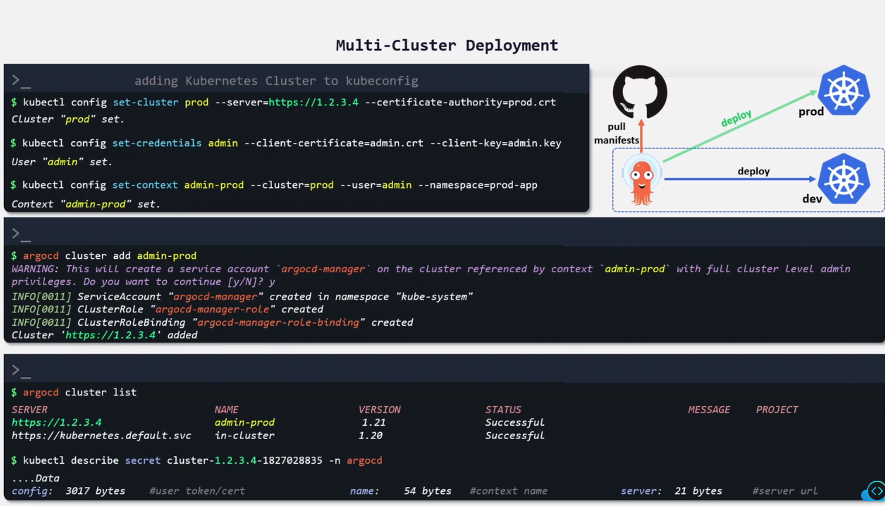
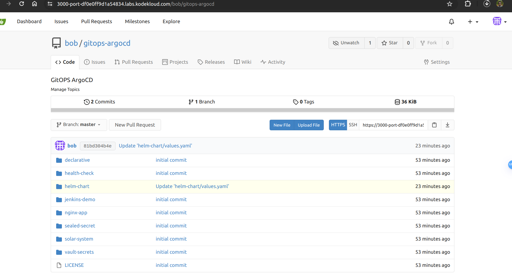

Gitea and ArgoCD are already setup. You can access the same using the respective buttons on the top bar.

Access the Gitea server with below credentials

    username: bob

    password: bob@123

Access the ArgoCD UI and CLI with below credentials.

    User: admin

    Password: admin123

    Add a new git repository in ArgoCD. Repository URL is <gitea-url>/bob/gitops-argocd.git

Access the Gitea server with below credentials

    username: bob

    password: bob@123

    argocd repo add <gitea-url>/bob/gitops-argocd.git

    Create an Argocd application as per details mentioned below and sync it:

    Application Name: helm-random-shapes

    Project Name: default

    Sync Policy: Manual

    Sync Options: Auto-create Namespace

    Repository URL: <Gitea URL>/bob/gitops-argocd.git

    Path: ./helm-chart

    Cluster URL: https://kubernetes.default.svc

    Namespace: default

Further set some values for helm as below

    Set Circle color: Pink

    Set Square Color: Red

    Set Service Type: NodePort

Access the Gitea server with below credentials

    username: bob

    password: bob@123

Access the ArgoCD UI and CLI with below credentials.

    User: admin

    Password: admin123

# Add a cluster called cluster2 to the list of Argocd clusters

argocd cluster add cluster2

Where does ArgoCD store the new cluster data?
Run the below command, to check the new cluster data:

kubectl -n argocd get secrets | grep -i cluster

Create an Argocd application as per details mentioned below and sync it:

    Application Name: health-check-app

    Project Name: default

    Sync Policy: Manual

    Sync Options: Auto-create Namespace

    Repository URL: <Gitea URL>/bob/gitops-argocd.git

    Path: ./health-check

    Cluster URL: https://controlplane-cluster2:6443

    Namespace: health-check

Access the Gitea server with below credentials

    username: bob

    password: bob@123

Access the ArgoCD UI and CLI with below credentials.

    User: admin

    Password: admin123

    Using kubectl utility, deploy the app-of-apps.yml manifest from gitops-argocd git repository within argocd namespace in default cluster i.e https://kubernetes.default.svc.

kubectl apply -f https://3000-port-df0e0ff9d1a54834.labs.kodekloud.com/bob/gitops-argocd/raw/branch/master/declarative/multi-app/app-of-apps.yml -n argocd

How many new ArgoCD applications were created after deploying app-of-apps.yml manifest?

kubectl get Application -n argocd

