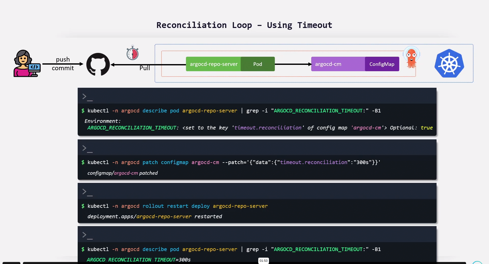
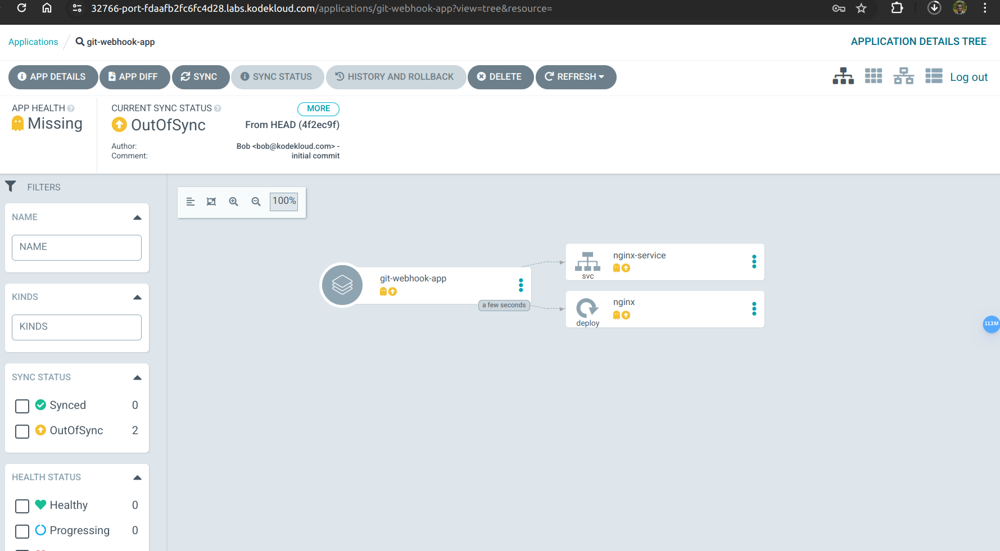

Using the details below, create an ArgoCD application.

    Application Name: git-webhook-app

    Project Name: default

    Sync Policy: Manual

    Sync Options: Auto-create Namespace

    Repository URL: <Gitea URL>/bob/gitops-argocd.git

    Path: ./nginx-app

    Cluster URL: https://kubernetes.default.svc

    Namespace: webhook

You can access the ArgoCD UI and ArgoCD CLI by using the following credentials.

    User: admin

    Password: admin123

    

    Next, Synchronize the git-webhook-app application and access the app using the NginxApp button on the top bar.

You can access the ArgoCD UI and ArgoCD CLI by using the following credentials.

    User: admin

    Password: admin123

    In Gitea, manually update the replicas to 2 in deployment.yml within the ./nginx-app directory and commit the changes.

What is the default reconciliation time (in minutes) taken by the ArgoCD app to detect the changes in Git repository?

In the gitops-argocd repository, update the replicas to 3 in deployment.yml within the ./nginx-app directory and commit the changes.

You can either make changes directly from Gitea or clone the repository and add/push your changes.

What is the time taken for the ArgoCD application git-webhook-app to go OutOfSync?

You can access the Gitea server by using the following credentials.

    Username: bob

    Password: bob@123

argocd app set argocd/git-webhook-app --sync-policy auto --sync-option syncInterval=1m

